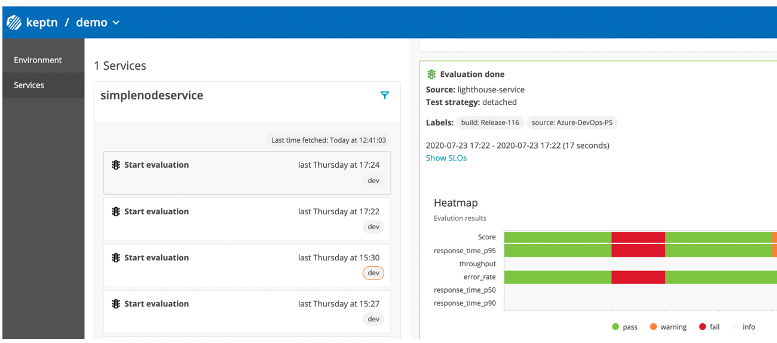
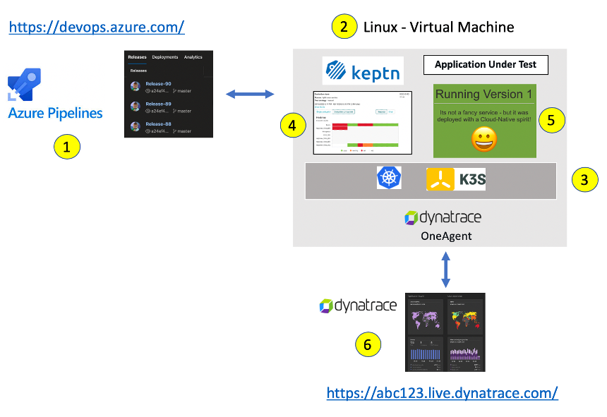
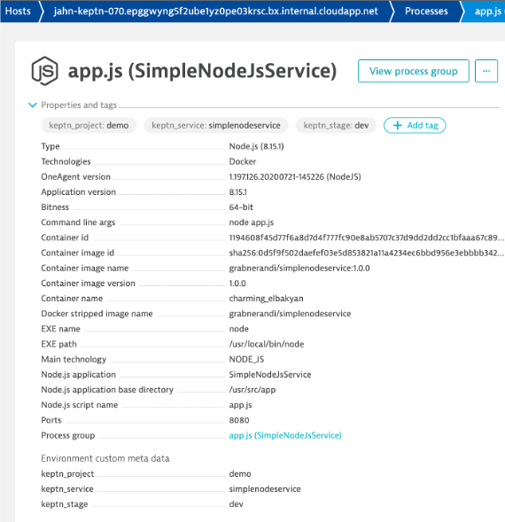
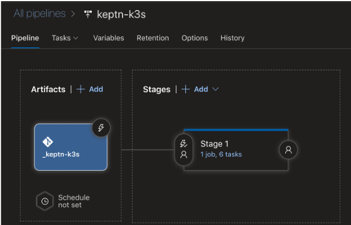
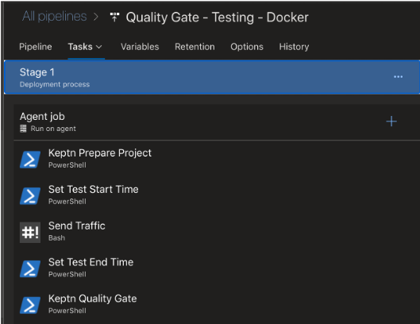
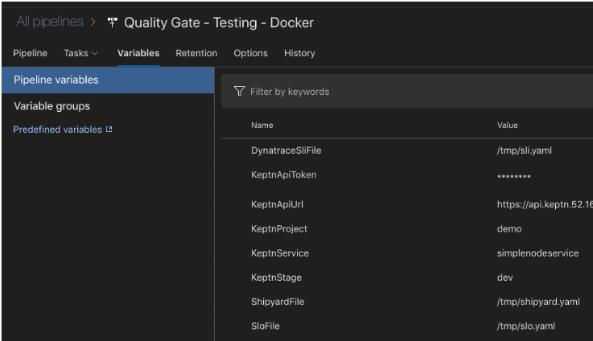

# Overview

This repo is show the how to setup Keptn with simple demo app for demonstrating quality gate use cases.  Instructions are provide to setup Keptn, a demo app, and running the keptn use case from Azure DevOps or manually.



The following Code is referenced in this demo:

* Keptn - https://keptn.sh
* K3s Keptn installer - https://github.com/keptn-sandbox/keptn-on-k3s
* Prepare Project - https://github.com/dt-demos/keptn-prepare-project-bash
* Quality Gate - https://github.com/keptn-sandbox/keptn-quality-gate-bash
* Simple NodeJS Demo App - https://github.com/keptn/examples/tree/master/simplenodeservice

# Keptn Compatibility Matrix

Refer to the image tagging for Keptn version compatibility

| Keptn Version    | 
|:----------------:|
|      0.7.1       |


# Setup

Referring to the diagram below, this is the demo setup:

1. Azure Devops - This is not required, but for the Azure Devops pipeline use case, the pipeline will call Keptn and run load tests against the demo application
1. Linux host for Keptn and Demo App. Instructions are below for setting this up as AWS EC2 instance and Azure Virtual Machine
1. Lightweight Kubernetes using [K3s](https://k3s.io/)
1. Keptn (https://keptn.sh) running with k3s
1. Demo app is a single Docker image that cab be deloyed within k3s or just run as docker container on the host
1. Dynatrace OneAgent that monitors the demo application.



# Keptn Setup on K3s

## 1. dynatrace

* need to have a Dynatrace tenant
* you need to make an api token for keptn installer to use.  See the [Keptn Docs](https://keptn.sh/docs/0.7.x/monitoring/dynatrace/install/#1-create-a-secret-with-required-credentials) for API Token setup requirements.

The Keptn installer will create the autotagging rules for keptn_project, keptn_service, keptn_stage based on DT_CUSTOM_PROP values. Here is how it looks within Dynatrace:



## 2. Provison a host for Keptn

Goto the cloud provider web console and add the VM following the guide below.  You will need to SSH into the host to run all the commands below, so have your key pair ready to use.  In Azure you can use password authentication for the VM, but this is not recommended.

<details>
  <summary>Azure VM</summary>

  ### Add an instance with these settings

  * Ubuntu Server 18.04 LTS
  * Standard D2s v3 (2 vcpus, 8 GiB memory)
  * public inbound ports 80, 443, 22, 8080  (You can add 8080 after VM is running)
  * install the Dynatrace OneAgent on the VM (get commands from within the Dynatrace web UI)

  ### Setup required variables for the keptn-on-k3s installer
  
  *Create Dynatrace API Reference:* https://keptn.sh/docs/0.7.x/monitoring/dynatrace/install/#1-create-a-secret-with-required-credentials
  
  ```
  export DT_TENANT=YOUR TENANT WITHOUT THE HTTPS:// PREFIX (e.g. aaaaaaa.live.dynatrace.com)
  export DT_API_TOKEN=YOUR API TOKEN
  export PUBLIC_IP=$(curl -s http://checkip.amazonaws.com/) && echo "My Public IP = $PUBLIC_IP"
  ```
  
  ### download and run keptn-on-k3s installer script
  
  ```
  curl -Lsf https://raw.githubusercontent.com/keptn-sandbox/keptn-on-k3s/0.7.1/install-keptn-on-k3s.sh | bash -s - --ip $PUBLIC_IP --with-dynatrace --with-jmeter
  ```

  **NOTE: Be sure to save the URLs, Tokens, and Bridge passwords for later.**

</details>

<details>
  <summary>AWS EC2</summary>
  
  ### Add an instance with these settings
  
  * Amazon Linux 2 AMI (HVM), SSD Volume Type
  * t2.xlarge
  * Pick - Auto-assign Public IP 
  * 16 GB storage
  * open port 80, 443, 22, 8080

  <details>
    <summary>Setup keptn-on-k3s for No Certificate</summary>

      This will make the DNS use xip.ip, for example $PUBLIC_IP.xip.io
      
        ```
        export DT_TENANT=abc12345.live.dynatrace.com
        export DT_API_TOKEN=YOURTOKEN
        curl -Lsf https://raw.githubusercontent.com/keptn-sandbox/keptn-on-k3s/0.7.1/install-keptn-on-k3s.sh | bash -s - --provider aws --with-dynatrace --with-jmeter
        ```

      NOTE: Be sure to save the URLs, Tokens, and Bridge passwords for later.

  </details>

  <details>
    <summary>Setup keptn-on-k3s with Certificate</summary>

      Assumes you have a Route53 DNS pointing to the public IP. Example FQDN value: jahn-keptn.alliances.dynatracelabs.com

      ```
      export LE_STAGE=production
      export CERT_EMAIL=noreply@dynatrace.com 
      export DT_TENANT=YOUR TENANT WITHOUT THE HTTPS:// PREFIX (e.g. abc12345.live.dynatrace.com)
      export DT_API_TOKEN=YOURTOKEN
      curl -Lsf https://raw.githubusercontent.com/keptn-sandbox/keptn-on-k3s/support-for-keptn-0-7/install-keptn-on-k3s.sh | bash -s - --provider aws --with-dynatrace --with-jmeter --letsencrypt --fqdn YOUR-FQDN
      ```

      NOTE: Be sure to save the URLs, Tokens, and Bridge passwords for later.

  </details>

</details>

# Setup Demo App on the host

## 1. Clone repo with demo app resources

```
git clone https://github.com/dt-demos/keptn-k3s-demo.git
cd keptn-k3s-demo
```
  
## 2. Deploy Demo app 

<details>
  <summary>Deploy within k3s</summary>

  ### alias for kubectl -- I am lazy or efficient you decide :)

  ```
  alias k='k3s kubectl'
  alias kk='k3s kubectl -n keptn'
  alias kd='k3s kubectl -n dev'
  alias kubectl='k3s kubectl'
  ```

  ### install demo app and verify status and in a browser

  ```
  k apply -f simplenodeapp.yaml
  kd get pods
  kd get svc
  echo "APP_URL = http://$(curl -s http://checkip.amazonaws.com/):8080"
  ```
  
</details>
 
<details>
  <summary>Using Standalone Docker Image </summary>
  
  ### install docker

  Run these commands within the ec2 instance

  ```
  sudo yum update -y
  sudo amazon-linux-extras install docker
  sudo yum install docker
  sudo service docker start
  sudo usermod -a -G docker ec2-user
  docker info
  ```
  *Reference:* https://docs.aws.amazon.com/AmazonECS/latest/developerguide/docker-basics.html

  ### Start Sample Application

  Run this command to run the sample node app on port 8080

  ```
  sudo docker run -d -p 8080:8080 -e DT_CUSTOM_PROP="keptn_project=demo keptn_service=simplenodeservice keptn_stage=dev" grabnerandi/simplenodeservice:1.0.0 
  ```
  
  ### verify status and in a browser
  
  ```
  echo "APP_URL = http://$(curl -s http://checkip.amazonaws.com/):8080"
  ```

</details>


# USE CASES

These use cases assume you have setup Demo App as described above.

<details>
  <summary>Use Case #1 - Test the Prepare and SLO validation from a pipeline in Azure Devops</summary>

This example assumes you will be using Dynatrace as a [Keptn SLI provider](https://keptn.sh/docs/0.7.x/monitoring/dynatrace/sli_provider/).  This use case uses the Dockerized scripts from these projects:

* Prepare Project - https://github.com/dt-demos/keptn-prepare-project-bash
* Quality Gate - https://github.com/keptn-sandbox/keptn-quality-gate-bash

### 1. Create an Azure DevOps project called keptn-k3s

When the pipeline is setup, it will look like this:





### 2. Import a Git repository

From the repo page, choose `Import a Git repository` and choose `git` and URL of `https://github.com/dt-demos/keptn-k3s-demo.git`

### 3. Create a release pipeline

If prompted, pick an `empty job` template.

On the `add an artifact`, choose `Azure Repos Git`, `keptn-k3s` project, the repo created above called `keptn-k3s`, and master branch.
  
Keep the default artifact alias name of `keptn-k3s`

### 4. Add these as pipeline variables

Below are example values, adjust according your environment.  See [Prepare Project README](https://github.com/dt-demos/keptn-prepare-project-bash) and [Quality Gate README](https://github.com/keptn-sandbox/keptn-quality-gate-bash) files for more details.

```
KeptnApiUrl      = [your url e.g. https://xx.xx.xx.xx/api]
KeptnBridgeUrl   = [your url e.g. https://bridge.keptn.xx.xx.xx.xx.xip.io/]
KeptnApiToken    = [your token]
KeptnProject     = demo
KeptnService     = simplenodeservice
KeptnStage       = dev
ProcessType      = [one of these values: ignore | fail_on_warning | pass_on_warning]
ShipyardFile     = /tmp/shipyard.yaml
SloFile          = /tmp/slo.yaml
DynatraceSliFile = /tmp/dynatrace-sli.yaml
```

When the variables are setup, it will look like this:



### 5. Add a Powershell task to Prepare Keptn Project

Call the task `Keptn Prepare Project` with this code

```
docker run -i --env KEPTN_URL=$(KeptnApiUrl) --env KEPTN_TOKEN=$(KeptnApiToken) --env PROJECT=$(KeptnProject) --env SERVICE=$(KeptnService) --env STAGE=$(KeptnStage) --env SOURCE=Azure-DevOps --env SHIPYARD_FILE=$(ShipyardFile) --env SLO_FILE=$(SloFile) --env DYNATRACE_SLI_FILE=$(DynatraceSliFile) --env DEBUG=true -v /home/vsts/work/r1/a/_keptn-k3s:/tmp dtdemos/keptn-docker-tasks:0.1.0 prepareproject
```

NOTE: You may need to adjust the Docker mapping. This example uses the value from `System.DefaultWorkingDirectory` Azure Builtin [Release Variable](https://docs.microsoft.com/en-us/azure/devops/pipelines/release/variables?view=azure-devops&tabs=batch
)

### 6. Add a Powershell task to Capture Evaluation Start Time

Call the task `Set Test Start Time` with this code

```
$StartTime = (get-date).ToUniversalTime().toString("yyyy-MM-ddTHH:mm:ssZ")

Write-Host "==============================================================="
Write-Host "StartTime: "$StartTime
Write-Host "==============================================================="

Write-Host ("##vso[task.setvariable variable=StartTime]$StartTime")
```

### 7. Add a Bask task to Send Traffice

Call the task `Send Traffic` with this code

```
$(System.DefaultWorkingDirectory)/_keptn/sendtraffic.sh
http://IP TO YOUR HOST:8080 10
```

### 8. Add a Powershell task to Capture Evaluation Start Time

Call the task `Set Test End Time` with this code

```
$EndTime = (get-date).ToUniversalTime().toString("yyyy-MM-ddTHH:mm:ssZ")
Write-Host "==============================================================="
Write-Host "EndTime:   "$EndTime
Write-Host "==============================================================="

Write-Host ("##vso[task.setvariable variable=EndTime]$EndTime")
```

### 9. Add a Powershell task to call the Keptn Quality Gate

Call the task `Keptn Quality Gate` with this code

```
docker run -i --env API_URL=$(KeptnApiUrl) --env BRIDGE_URL=$(KeptnBridgeUrl) --env KEPTN_TOKEN=$(KeptnApiToken) --env START=$(StartTime) --env END=$(EndTime) --env PROJECT=$(KeptnProject) --env SERVICE=$(KeptnService) --env STAGE=$(KeptnStage) --env PROCESS_TYPE=$(ProcessType) --env SOURCE=Azure-DevOps --env DEBUG=true --env LABELS='{\"source\":\"Azure-DevOps-Inline\",\"buildId\":\"$(Release.ReleaseName)\"}' dtdemos/keptn-docker-tasks:0.1.0 qualitygate

```

### 10. Review results

Open up the Keptn Bridge in a browser and you should now see and monitor the evaluation under the project `simplenodeservice` and and a stage `dev`.

If you did not capture them earlier, use these command to get the URL and credentials:

```
echo "Bridge URL = https://bridge.keptn.$(curl -s http://checkip.amazonaws.com/).xip.io"
keptn configure bridge --output
```

</details>

<details>
  <summary>Use Case #2 - Onboard Demo Application to Keptn manually (no pipeline)</summary>

This set of steps prepares the the keptn project from a SSH session within the host.

### 1. Install the Keptn CLI 

Run this script provided by Keptn team and verify the CLI is on version 0.7

```
curl -sL https://get.keptn.sh | sudo -E bash
keptn version
```

### 2. Initialize CLI with your credentials

Setup required variables (post keptn install) for authorizing keptn CLI

```
export PUBLIC_IP=$(curl -s http://checkip.amazonaws.com/)
export KEPTN_API_URL="https://api.keptn.$PUBLIC_IP.xip.io"
export KEPTN_API_TOKEN=$(k3s kubectl get secret keptn-api-token -n keptn -ojsonpath='{.data.keptn-api-token}'  | base64 --decode )
echo "KEPTN_API_URL   = $KEPTN_API_URL"
echo "KEPTN_API_TOKEN = $KEPTN_API_TOKEN"
keptn auth --api-token "$KEPTN_API_TOKEN" --endpoint "$KEPTN_API_URL"
```

### 3. Onboard demo app to Keptn

Run manual commands to onboard project to keptn along with demo app resources files

```
keptn create project demo --shipyard=shipyard.yaml
keptn create service simplenodeservice --project=demo
keptn configure monitoring dynatrace --project=demo
keptn add-resource --project=demo --stage=dev --service=simplenodeservice --resource=slo.yaml --resourceUri=slo.yaml
keptn add-resource --project=demo --stage=dev --service=simplenodeservice --resource=sli.yaml --resourceUri=dynatrace/sli.yaml
```

### 4. Verify demo app onboarding

Open up the Keptn Bridge in a browser and you should now see the project `simplenodeservice` and and a stage `dev`

Use these command to get the URL and credentials:

```
echo "Bridge URL = https://bridge.keptn.$(curl -s http://checkip.amazonaws.com/).xip.io"
keptn configure bridge --output
```

</details>

<details>
  <summary>Use Case #3 - Test the SLO validation manually (no pipeline)</summary>


This assumes you have completed the Keptn Onbaording already. (i.e. USE CASE #1 or #2)

### 1. Send load and invoke the keptn `start-evaluation` event using the Keptn CLI

```
./sendtraffic.sh "http://localhost:8080" 150
keptn send event start-evaluation --project=demo --stage=dev --service=simplenodeservice
```

### 2. Open up the Keptn Bridge in a browser and you should now see and monitor the evaluation under the project `simplenodeservice` and and a stage `dev`

Use these command to get the URL and credentials:

```
echo "Bridge URL = https://bridge.keptn.$(curl -s http://checkip.amazonaws.com/).xip.io"
keptn configure bridge --output
```

This set of steps prepares the the keptn project and test the SLO validation all from the SSH session within the host.

</details>
